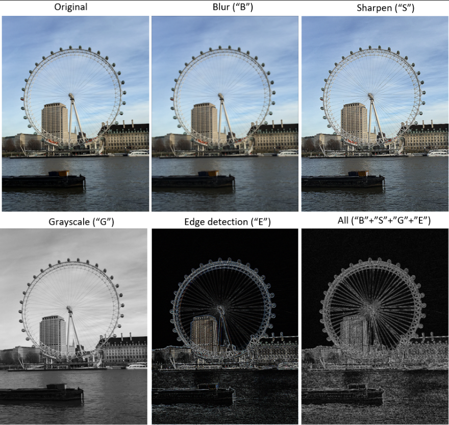
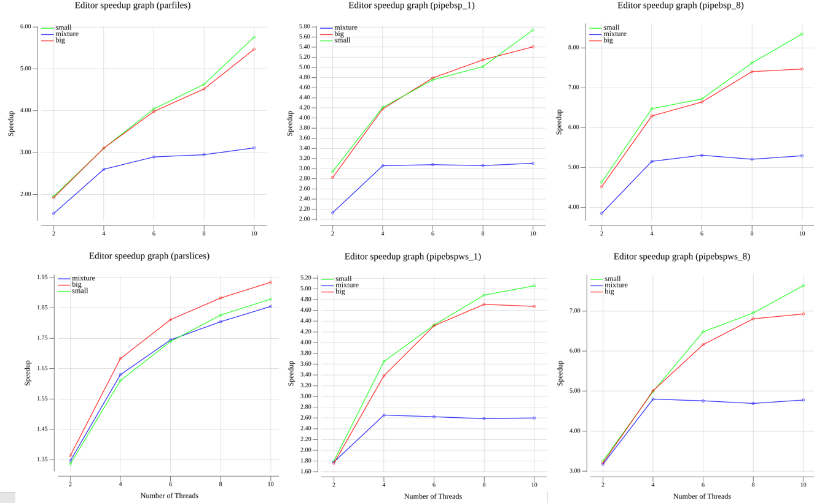
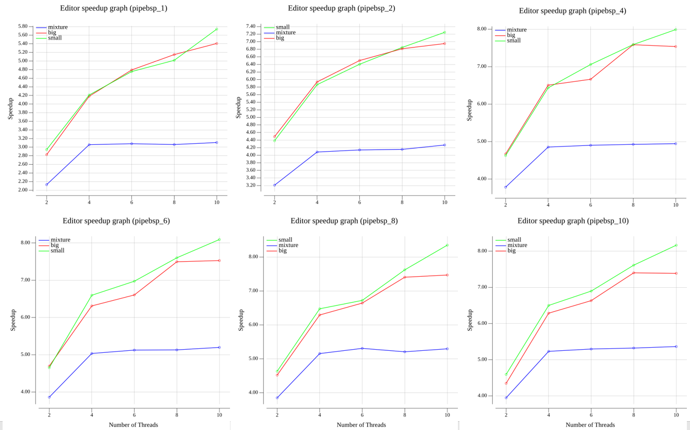
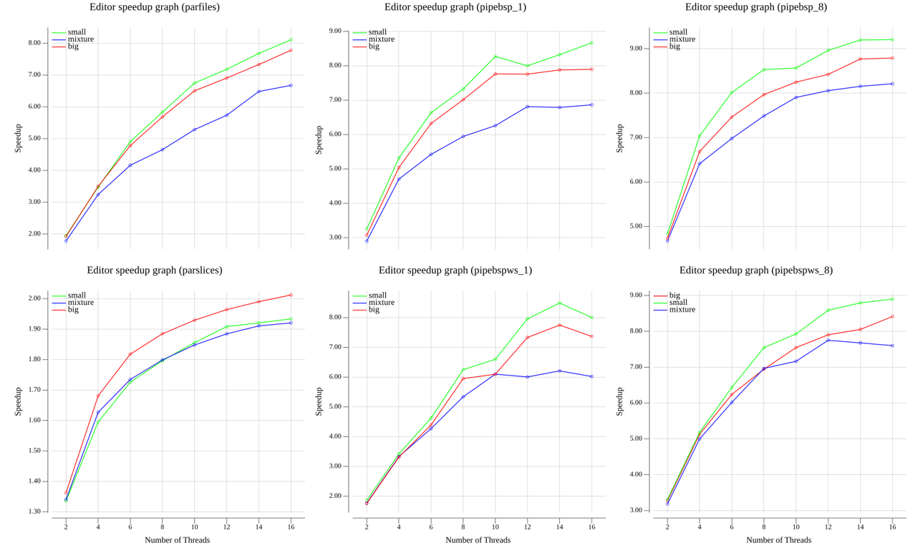
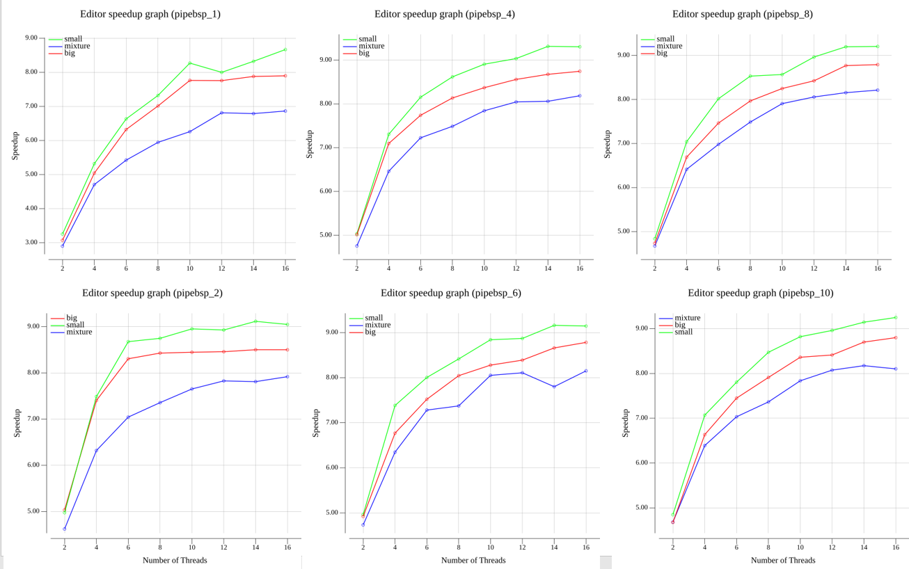
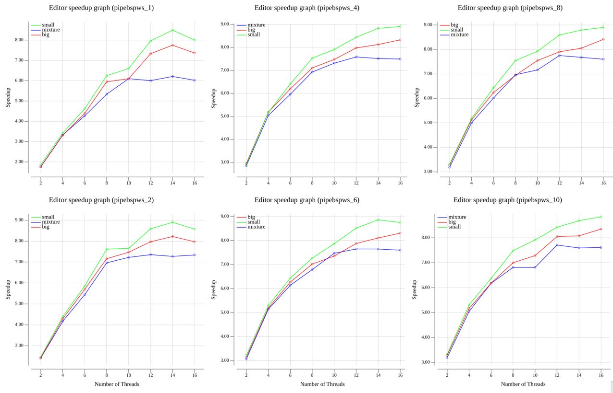

# Summary

I chose to re-implement the image processing application in `project1` with three new features: 
- (i) A `pipeline` with three phases: (1) loading the data from disk (2) processing data from disk (3) writing the data back to disk.
- (ii) `bsp` for image processing in slices: during phase 2 of the pipeline, a go routine can process an image by slicing it and distributing to multiple *sub-routines*. Each sub-routine apply the effects to it's slice and when finished, awaits for the other routines to finish before proceeding to the next.
- (iii) Work Stealing (WS) refinement. In the WS, each go-routine/worker holds a DEQueue of runnable tasks; when go-routines are finished with their tasks, they randomly steal tasks from other go-routines.

As a result of these changes, some modifications were made to the main `editor.go` executable and to the analysis cases. Please see the below sections for details.

Obs.: A new option `[chunk size]` was also added to run the overall pipeline in chunks of images to potentially reduce memory consumption, but I ended up not needing to use it.

## Outline:
- Section 1 recapitulates the program crated in this project and section 
- Section 2 describes all the parallel implementations, especially the introduced features: pipeline with BSP and the work stealing
- Section (3) contains usage instructions
- Section (4) contains analysis and comparison for the different parallel strategies

# 1) Project description

In this project, an image processing program was created that considers four different types of effects to apply to images.

The figure below shows the application of each effect separately. The *all* image illustrate the application of all the four effects to the original image in conjunction.




# 2) Implementation

The project was implemented in the `go` language, with the following variations in implementation:

- A `sequential` version, where each image provided is processed at a time sequentially

 And Four parallel versions:

- `parfiles`: each image is loaded, processed and saved by multiple threads.

- `parslices`: each image is divided into multiple slices, each of which is processed by a thread. In this implementation, Each image is loaded and saved at a time.

- `pipebsp` and `pipebspws`: details in the next two sections
## 2.1) New feature:  pipeline and BSP

`pipebsp` strategy consists of the following:
- the program spawns multiple go routines according to the user input  `number of threads`. These are the `workers`.

- All workers execute a pipeline consisting of (1) load images from disk; (2) apply the effects; (3) save modified images to disk.

 - In phase (2), a worker have two options:
	 - (A) process the full image itself (similar to `parfiles`)
	 - (B) divide the image in slices and spawn sub-routines to process each slice. The number of sub-routines spawned comes from the `number of sub-threads` input given by the user.
	 - If option (B), the  sub-routines are synchronized using a barrier between effects. After processing it's slice, a go-routine will wait until all other routines have been finished before proceeding to the next effect.

- The pipeline is implemented via channels. The `in` and `out` elements of the pipeline are `Runnable` `Tasks`
	- `Runnable` is an interface that `Tasks` implement so that they "execute themselves". 
		- All the details of execution are encapsulated in the `Task` struct and it's methods. The worker have only to call `Task.execute()`
	
	- After the `Task` finishes it's execution, it creates a `Runnable` `Task` of the next phase and and send it over the channel
		- For example, if `Task_Phase1` finishes, it creates a `Task_Phase2` and send it to the next stage of the pipeline

	- The design choice using tasks that execute themselves is useful for the work stealing case and was used here also to make comparisons cleaner.

## 2.2) New feature: work stealing
`pipebspws` has the same design as `pipebsp`, but adding a **work stealing refinement**. 
###  Work Stealing implementation
The package `WorkStealing` contains all the constructs for the Work Stealing.

`CircularArray`
- Is an array of tasks that is accessed via modular arithmetic. 
	- Ex: if a worker uses the index 20 to access an array with 8 entries, it will be accessing the element at (20 % 8 = 4)
- May be resized through the method `Resize`:
	- A new `CircularArray` with double the capacity is created and all tasks of the previous array are transfered to it.

`DEQueue`
- Is a double ended queue implement using the  `CircularArray` offering a thread-safe way for multiple workers to get tasks from the array and/or steal tasks from others
- In the work stealing, each `DEQueue` of tasks has a worker as it's owner. 
- The thread owner of a `DEQueue` only access it through the methods `pushBottom` (to add tasks) and `popBottom` (to retrieve).
- Thieves can access other thread's `DEQueue`s  through  `popTop` method. 

- The potential conflict between owners and thieves is resolved as follows (please see comments in the code for more details):
	- Thieves access the queue's element using the `top` index. 
	- Owners access the queue's element using the `bottom` index
	- If the difference between `top` and `bottom` is greater than one:
		- thieves steal tasks from the top of the queue while owner get tasks from the bottom; no conflict between them.
		- Conflict between thieves is resolved by a CAS on the `top` index. If a thief looses the `CAS`, `popTop` returns `nil` and it gave up. 
	- If the difference comes to one, the conflict is resolved by a CAS executed on the `top` index by both the owner and the thieves . The winner gets the task. The loser gives up 

**Obs1**: giving up is not a problem; a thief may go steal another task; if the owner gives up is because it's queue is empty (and it will enter stealing mode)

**Obs2:** **important** the `top` index **always** increase. This prevents the **ABA** problem in this implementation in the same manner as a stamp would prevent in a bounded queue. Also, notice due to modular arithmetic, this does not create "gaps"  in the queue; entries are re-use; and threads can still access elements even if `top/bottom` is greater than `capacity`.

This is easier to see with an example:
- Suppose capacity is `4`. Bottom pointer is at 4 and top pointer is at 0.
- Thief A comes to steal `top=0` and freezes.
- Thief `B` comes in also with `top=0` and steals the task. For doing so, `top` is incremented to 1 (see the `CAS` operation in the code)
- The owner of the queue adds a new task in the queue's entry `[0]` by doing `push 4` (4 % 4 = 0 => added to entry zero).
- Thief A unblocks and tries to access `top=3` and will not succeed in the CAS, returning `nil`, even if there is an element in `[3]` (**no ABA problem**)
- Notice the element in `[0]` is still accessible by other threads.
	- Example: after `top=1`  `top=2` `top=3` are accessed, `top=4`%4=0 will be accessed.
	- In fact, it could be accessed by any index whose `index % capacity`=4. This is what allow `top` to always increases and `bottom/top` achieves values larger than `capacity`

**Obs3**: **On data races**: Since only the owner of the queue access the `bottom` index, in some parts an atomic operation is not needed. I only used atomics when there was a need to communicate the state of the `bottom` index to the other threads. But since both thieves and owner reads `bottom`, if the code is ran with `Go`'s race detector it will signalize a *data race*. 

### Execution of the pipeline in the work stealing case
- Each worker holds a `DEQueue` of  `Runnable` `Tasks` and pointers to the `DEQueues` of other workers.

- In each pipeline phase, there are `number of threads` workers that can execute tasks

- In each phase of the pipeline, tasks are evenly divided between workers.  This is the only moment when tasks are added to the `DEqueues`.
	- That is, once a worker finishes adding tasks, it does not add anymore tasks to it's DEQueue. 
	- Nonetheless, I provided in the test script a case where workers change between "execution" mode and "adding" tasks mode to verify the work stealing is fully working.

- Before starting executions/stealings, each worker fills it's DEQueue with the tasks coming from the previous pipeline stage until it achieves the number of tasks assigned to it.
	- Note that the pipeline flow is not blocked by this feature: a worker may start processing an image (phase 2) before all images are loaded (phase 1) or even save an image (phase 3) before all images are loaded (phase 1 finishes)

- If a worker runs out of tasks, it starts stealing tasks from other workers randomly

- As mentioned above, in phase (2) a worker may slice the image and spawn sub-routines to process it. There is no work stealing at the level of the sub-routines.


### Testing
I did not provide a formal `go` test script. But the files `WorkStealing/WorkerTest.go` and `TestWorkStealing/main.go` provide
- (i) an example of work stealing with workers both adding and executing tasks 
- (ii) in `main`, a case where tasks are unbalanced and a busy worker may have many tasks stolen while also adding work to it's queue.
- Results of running `main` are saved to a log. This log can be checked to see:
	- workers successfully execute their tasks
	- that tasks were stolen and successfully executed by thieves
	- if all task were executed and if there was any duplicate execution by running `python count_duplicates.py`
## 2.3) Effects implementation

The effects `sharpen ("S")`, `edge detection ("E")"` and `blur ("B")` are obtained by applying a **convolution with zero-padding** to the images. The table below shows the kernels used in the convolution for each effect.

|Image Effect| Kernel|
|---|---|
|`"S"`|`[9]float6 {0,-1,0,-1,5,-1,0,-1,0}`.|
|`"E"`|`[9]float64{-1,-1,-1,-1,8,-1,-1,-1,-1}`.|
|`"B"`|`[9]float64{1 / 9.0, 1 / 9, 1 / 9.0, 1 / 9.0, 1 / 9.0, 1 / 9.0, 1 / 9.0, 1 / 9.0, 1 / 9.0}`.|

Obs: kernels are provided as flat arrays, but they are used as square matrices. 

See this [reference](http://www.songho.ca/dsp/convolution/convolution2d_example.html) for more details about convolution, including the formulas used in this project.

The `grayscale effect ("G")` is obtained by replacing each RGB values of a pixel by the averages of these three values 

# 3)  Usage 

For all that follows, first clone the git repository executing:
`git clone https://github.com/mpcs-jh/project-1-mshalimay `

And navigate to the root folder `proj3`

**VERY IMPORTANT**: all executions should be done from the root folder `proj3`. Executing  `go` or `bash` scripts from other folders might give unexpected behavior. 

This is due to the project requirement that the scripts operates in terms of relative paths.

So for example:
	- **Do**: navigate to proj3 `cd proj3` and run the editor with `go run editor/editor.go`
	- **Don't**: navigate to the editor directory and run the editor as `go run editor.go`

## 3.1) Usage of the editor
`editor.go` contains the program for image processing. 
To use it, First we have to add some images and effects to be applied to them. Then we execute the editor. 


Steps:

1) Add subdirectories in the `data/in` folder for the images to be processed.  For example, `data/in/myimages` might contain some `png` pictures

2) Create a `effects.txt` in the `data` directory. This file must contain the images to be processed and the effects to apply to then in JSON format. Below is an example of the `effects.txt` used to create the images in 1.1 above:

```txt
{"inPath": "IMG_2029.png", "outPath": "IMG_2029_G_Out.png", "effects": ["G"]}
{"inPath": "IMG_2029.png", "outPath": "IMG_2029_E_Out.png", "effects": ["E"]}
{"inPath": "IMG_2029.png", "outPath": "IMG_2029_S_Out.png", "effects": ["S"]}
{"inPath": "IMG_2029.png", "outPath": "IMG_2029_B_Out.png", "effects": ["B"]}
{"inPath": "IMG_2029.png", "outPath": "IMG_2029_ALL_Out.png", "effects": ["G","E","S","B"]}
```

3) Navigate to the root directory `proj3` and execute 
`go run editor/editor.go <data_dir> <mode> [number of threads] [number of sub-threads] [chunk size]`

Where:
- `data_dir` is the subdirectory containing the images to be processed created in step 2 (ex: `myimages`)
- `mode`: `s` for sequential, `parfiles` for the parfiles implementation, `parslices` for the parslices implementation
- `number of threads` (optional): the number of threads to use in the parallel implementations. If not provided defaults to the sequential implementation
- `number of sub-threads` (optional):  Only for PipeBSP modes. Number of sub-routines each thread can spawn for image processing in slices. Defaults to 1.
- `chunk size` (optional): Only for PipeBSP modes. How many images can be in the pipeline at the same time. Defaults to all images provided.

Also, run `go run editor/editor.go` to print the usage to the prompt

4) The resulting images will be saved in the `data/out` directory. 
	- Also, the time for the execution will be saved in the `result.txt` file located in the `proj3/benchmark` directory

## 3.2) Benchmark
The script `benchmark/bencharmk-proj3.sh` is set to execution of all the results for the `few` experiment. See details on 2.2 on how to tweak it.


Below details about the benchmark script

### Benchmark script description
The `benchmark-proj3.sh` script located in the `proj3/benchmark`:
- run a sequence of executions of the `editor.go` program for different combinations of ``number of threads``, `mode`, `data_dir` and `num of sub-threads`

- The executions can be ran with `few` or `many` images, controlled by the array of strings `experiments` and the integer `many`
	- If `experiments = "many"`, the script will: create `many` replicas of each image in the data directories and of their respective effects
	- For example, `many=4` and `data_dirs=small` will create four replicas of each image in the `small` directory
	- This is used to the implementations when there are many images

- Save the runtime of each execution in the `proj3/benchmark/results.txt` file. 

- After all the executions, the script:
 1) Saves all result for an experiment in separated `results_<experiment>.txt` file
 2) executes the `proj3/benchmark/plot.go` routine, which:
	- compute  average times, speedups and best times using the runtimes in the `results_<experiment>.txt` file. These metrics are saved into separate text files located in  `proj3/benchmark/<experiment>/` folder
	- create plots for the speedups for each of the parallel modes in the `results<experiment>.txt` file. The plots are saved in the `proj3/benchmark/<experiment>/` folder as `.png` files

### Tweaking ``benchmark-pro3.sh`` for usage

- The standard `benchmark-proj3.sh` script runs 3 executions for all combinations of modes, threads in {1, 2, 4, 6, 8, 10, 12, 14, 16}, subthreads in {1, 2, 4, 6, 8, 10} and three subdirectories named "small", "mixture" and "big" for the `few` experiment.

- To modify the settings for run, open the `.sh` script and alter the following:

````bash
...
experiments=("few") # few rans all combinations for directories with `x` images; "many" rans all combinations for directories with many * x images

many=3 # triplicate the number of images and effects for each folder and run all combinations

data_dirs=("small" "mixture" "big") # modify this according to your images directories

modes=("s" "parfiles" "parslices" "pipebsp" "pipebspws") # modify this according to the modes desired

threads=("1" "2" "4" "6" "8" "10") # modify the number of threads 

# number of threads to slice each image into. Only affects the pipeline-bsp implementations
subthreads=("1" "2" "4" "6" "8" "10")

repeat=3 # modify this to 'x' to run 'x' times each combination of data_dir, mode, threads and subthreads
...
````

- To run locally, run `chmod +x benchmark/benchmark-proj3.sh` to make the script executable and then `benchmark/benchmark-proj3.sh` to execute it

### Using ``benchmark-proj3.sh`` in UChicago CS clusters**

- Open the `benchmark-proj3.sh` and modify the line for the user
````
#SBATCH --mail-user=<your_user_name>@cs.uchicago.edu
````

- And the working directory for slurm according to your directories. Mine is as below. Notice that the working directory must be the root folder for the `proj3` since the scripts use relative paths (as required in the project specs)
````
#SBATCH --chdir=/home/mashalimay/ParallelProgramming/project-3-mshalimay/proj3/
````

- The results from `sbatch` will go to `slurm/out` directory in the root folder. The repo contains an empty folder, but make sure you have this folder or else `slurm` gives error.

- The standard `benchmark-proj3.sh` script is set to run 5 executions for all combinations of modes, threads in {1, 2, 4, 6, 8, 10, 12} and three subdirectories named "small", "mixture" and "big" and for two experiments:
	- "few", with 10 images to be procesed (as in proj1)
	- "many", with 40 images to be processed

- To download the data, use this [link](https://www.dropbox.com/s/cwse3i736ejcxpe/data.zip?dl=0) . Please place it in the proper directories as specified in 2.1

- After this, just run
 `sbatch benchmark/benchmark-proj3.sh`

- Obs: One might also want to modify the time required. To run all the directories, 3 times for all combinations of modes and threads, I recommend setting it to 4 hours to guarantee full execution

````
#SBATCH --time=4:00:00
````

## 3.3 Just plotting
- Given existing `results_<experiment>.txt` files with data from previous runs of the parallel implementations, it is possible to compute the performance metrics and plot speedups by running `benchmark/benchmark.go <experiment>` from the root directory `proj3`

Example: 
`go run benchmark/benchmark.go few`
`go run benchmark/benchmark.go many`

****
# 4) Analysis

All data for the plots and tables are in the files `benchmark/results_few.txt` and `benchmark/results_many.txt` 

This data can be generated by running `benchmark-proj3.sh` as explained in section 2.2.

All analysis based on runs in the `peanut` cluster with **16 threads** and **900mb of RAM** per thread.

## 4.0) Comments on experiments and comparisons

1) To measure the performance of the parallel implementations in this project, I did two experiments: 

- A `few` experiment, in the same vein as Project 1: all parallel implementations are ran for the three directories `small` `mixture` `big` each containing 10 images and speedups relative to the sequential case are computed.

- A `many` experiment, where I create a replica of all the images in each directory and of the effects to apply to them "*many*" times. All combinations of threads and parallel implementations are ran for this bigger dataset and speedups are computed.
	- For this write-up, `many=3`, that is: all combinations of parallel modes, threads and sub-threads are ran for the triple of images and effects in `few`.
	- Why this? With too few images (10) relative to the number of threads, it is difficult to evaluate the gains of the new implementations. This experiment scales the size of the problem by 3 without changing the structure of the files and computations being applied. This gives a clean way of measuring the gains of new implementations;particularly, cleaner than adding new/different images/effect
2. Since comparisons between `parfiles` and `parslices` were made in Project 1, I will focus the analysis on the new implementations `pipebsp` and `pipebspws`. I explore the comparison between `parfiles` and `pipebsp`/`pipbespws` because this showcases the gains of the new implementations. I also compare variations of `pipebsp` to visualize effects of sub-threads and work stealing.

## 4.1) Analysis: `few` experiment

Below image show the speedups for the four parallel modes. For each `pipebsp` modes, I show two plots: one where threads/workers process the whole image themselves (`pipebsp_1`) and one where they are allowed to spawn 8 sub-threads to process the images in slices (`pipebsp_8`). By comparing `parfiles/parslices` to `pipebsp_1` we isolate the effects of pipeline. By comparing `pipebsp_1` to `pipebsp_8` we see the effects of allowing images to be sliced; by comparing `parfiles/parslices` to `pipebsp_8` we we see the effects of both pipeline and bsp.

**Comments**

- As in Project 1, the `parfiles` implementation shows a better speedup and the `parslices` implementation performs relatively poorly, with gains phasing out very quickly and do not reaching even 2x speedup.

- Both `pipebsp_1` implementations perform **worse** than the simple `parfiles` implementation when not allowed to spawn sub-thrads.
    - This worse performance is explained by having few images to be processed; the overheads of building the pipeline setup does not compensate and one can benefit more of simply spawning threads to do the whole load-modify-save the images
    - Similarly, having a work stealing along with the pipeline does not help - in fact, performance is a little worse when compared to the `pipebsp`


- Adding the `bsp`/slicing in the pipeline improves speedup, to the point of turning both `pipebsp` implementations faster than `parfiles` for all directories.

    - Notice this happens even when using much more threads than processors in the machine
    - Why the gains: while threads are blocked by I/O, the slicing threads can perform work, speeding up the whole processing, even if the number of processors is smaller than the number of threads


- The work stealing does not improve performance in this experiment. This can be seen by comparing `pipebsp` and `pipebspws` charts; performance with work stealing is a little bit worse, probably due to the overhead of building the DEQueues and more atomic/CAS operations.

- As in project 1, for the `mixture` directory, the speedup flattens faster due to idleness of processes. Having a pipeline does not affect this behavior. 

- Importanly, the work stealing, which could be a beneficial implementation due to the unbalanced workload, does not improve the relative performance among the directories (that is, the gap between the 'blue' line and the other two in the `pipebspws` plot remains high). 
  - The reason for this lack of effect is due to the number images/thread being small. Even with WS, in the very end of processing some threads will become idle, since in the limit each will have one image to process and the ones with larger images will take more time. With few images, the time to process the "last" big images is a greater fraction of the **total** computation and WS cannot do much about that. It is easier to see with an illustration: 
    - Suppose we had 4 images and 4 threads. In this case, does not matter if there is work stealing or not: each thread will finish their images at their own times and the other 3 will remain idle while the one with the bigger image process it. And this will be the main component of the total time. 
    - In contrast, the situation would be different with 100 imagesand 4 threads. Even though some threads will be idle at the end, this will be a small portion of the total computation time.





To illustrate the gains of slicing, chart below show speedups for the `pipebsp` mode when we change the number of sub-threads each worker can spawn. 

Obs: I show only the trends for `pipebsp` because they are identical to `pipebspws`; nonetheless, the plots for the latter are in the `benchmark/few` directory.

**Comments:**
- The curves are steeper in the beginning and flatten out as we add more main threads/workers. 
- The gains of spawning sub-threads flattens at 8 sub-threads. 
- Why this:
  - Important to remember we have 16 processors in the machine, so we are spawning much more threads than we have processors.
  - So there are gains for adding sub-threads mainly because of the I/O component of the program: the sub-threads can do work while other threads are waiting I/O. 
  - But as we increase the number of threads (either by addin workers or sub-threads), these gains phase out and since there will be less space for sub-threads to perform work while other threads are idle and as they cannot improve the CPU-bound of this program.
  



## 4.2) Analysis: `many` experiment

Previous section showed there was no gain in having a pipeline and work stealing relative to the simple `parfiles` implementation. In fat, one could simply add a slicing component to the `parfiles` implementation to get a better performance with a less complex algorithm.

However, in that case the number of images/thread was very small. Therefore, one reason to justify the more complex `pipebsp` implementations would be if they scale better as the problem size increases.

In this section, I give an idea of the scaling by repeating the `few` experiment for a problem that is the same, except for being the triple of the size. 

Obs: this experiment is by no means extensive. Although bigger, the problem size was kept relatively small (30 images) due to limitations of time. A better measurement would be obtained with more images relative to threads. Nonetheless, this was sufficient to illustrate the point of scaling and the effects of work stealing in unbalanced workloads.

Image below show the same speedup charts as in Section 3.1.

**Comments:**
- Different from previous section, both `pipebsp/pipebspws` implementations improve speedups relative to the `parfiles` implementation. The difference is modest though, and this reflects the fact that we still have a relatively low amount of images/thread.
- Again, the best performance is achieved when `pipeline` is used along with `bsp`; that is, when workers in the pipeline can spawn sub-threads to process images in slices.

- Comparing the `pipebsp` and `pipebspws` plots, we see that performance with work stealing was the same or a little bit smaller. Explanation:
  - There is more overhead with workstealing due to the greater number of atomics/CAS and for mantaining the DEQueues in each worker. And the number work/threads is still relatively small; with more work/thread, this overhead should become more dilluted and the difference gets smaller. 
  - With effect, the difference in computation time between the two is smaller in this case than in the `few` images case
  - The environment here is very controlled: we are running in a single machine with exclusive access with virtually no other processes competing for the CPUs. Therefore, there is small space for a great unbalance in finishing times between threads, which is what the work stealing could benefit from and compensate for the overheads of synchronization.

- For the effects of **work stealing** in unbalaced workloads it is important to evaluate the **gap between the blue and red/green lines** in the plots. 
  - To remember, the gap appears because in the mixture case, some threads become idle as the threads with bigger images finish their work, limiting the scaling as the #threads grow when compared to no/small idleness (big and small)
  - A smaller gap thus means the `mixture` case is getting closer to cases with no/small idleness.
  - With effect, notice the gap is smaller in `pipebspws` compared to the non-workstealing `pipebsp`.
  - That is, although the performance with WS is no better, **the gains in speedup are more homogeneous among workloads**.
  - Notice also the gap becomes larger again as the number of threads goes above 12~14. This is expected and is a convergence to what we saw in the `few` case: as the number of work/thread becomes small, the stealing of work have less impact on the overall time. Again, an illustration helps:
    - Suppose 30 images and 2 threads; the first receives the bigger images and the second the small. In this case, T2 will finish first but will then start processing images from T1. In the very end one may become idle because the other is processing the last bigger image but this idleness time is a small fraction of the total time. Overall, for most of the time no thread was idle as in the cases of a balanced workload (like in `big` or `small`). Therefore, the speedup should be similar for those cases (the gap between blue and red/green line is smaller).
    - In contrast, with 30 images and 29 threads with small images and 1 with a big image, 29 threads will be idle and the idle time is big fraction of the total time; so the blue speedup curve flatten as the number of threads becomes large relative to the number of work.




Finally, below is the plot showing the speedups of `pipebsp` and `pipebspws` as the number of sub-threads grows. 

**Comments:**
- Similar to 3.1, the gains of spawning sub-threads tends to flatten as the number of threads/worker grow. 
- But interestingly, even with many more threads that processors (like in the cases with 16 threads, each spawning 10 sub-threads) there seems to be no penalites, showcasing efficient is `Go` in managing the threads. 
- Notice also again how the gap between blue and red/green lines in the `pipebspws` plots is smaller than in the `pipebsp`, showcasing the effects of stealing in making the `mixture` case converge to the small idleness case and making the speedups more homogeneous among workloads.







# 4.3 Answers to specific questions

**Describe your program and the problem it is trying to solve in detail.** 

Answered in section 1

---

**A description of how you implemented your parallel solutions, and why the approach you picked (BSP, map-reduce, pipelining) is the most appropriate. You probably want to discuss things like load balancing, latency/throughput, etc.**

The description was answered in section 2

I chose the pipeline because it fits well in the problem we have here, in which we have to load images, process them and save back to the disk. 

The pipeline is useful becausn as soon an image is loaded, it can be redirected to any other processor that is available to apply the effects. Similarly to other stages.

The `BSP` was chosen for the slicing of images because it fits very well to the problem: a barrier comes out directly from the fact that one effect is dependent on the previous and the sub-threads should wait until proceding to the next one.

---

**Describe the challenges you faced while implementing the system. What aspects of the system might make it difficult to parallelize? In other words, what did you hope to learn by doing this assignment?**

The most difficult aspect for me was to parallelize is the consecutive application of effects. Introducing the barrier using the BSP as I did adds some sequentiality. Further parallelization could be achieved by letting other sub-threads do work in parts of the images that are ready for processing.


---
**What limited your speedup? Is it a lack of parallelism? (dependencies) Communication or synchronization overhead? As you try and answer these questions, we strongly prefer that you provide data and measurements to support your conclusions.**

**Compare and contrast the two parallel implementations. Are there differences in their speedups?**

Answered in sections 4.1 and 4.2

---

**What are the hotspots (i.e., places where you can parallelize the algorithm) and bottlenecks (i.e., places where there is sequential code that cannot be parallelized) in your sequential program? Were you able to parallelize the hotspots and/or remove the bottlenecks in the parallel version?**


- Hotspots/Bottlenecks:

  - the `ApplyEffect` calls, which contains the majority of FLOPs of the sequential program due to the execution of `Convolution(..)` and/or `Grayscale(...)` in sequence. These two functions iterate over each pixel doing a group of flops per pixel (especially `Convolution`). This was parallelize in the `bsp` addition to the pipeline

  - Saving/loading of images to disk. This was parellelize in the `pipeline` implementation.

  - The creation of DEQueues and distribution of work among the threads in the work stealing case. In the start of each phase of the pipeline, the first operations are to fill the DEQueues with work. This introduces a bit of sequentiality that I could not get rid of. 
    - One option would be to have workers specialized in populating the DEQueues and others in stealing work, but even so, I am not sure if this would be better, since stealing work has more overhead than executing own work. 


